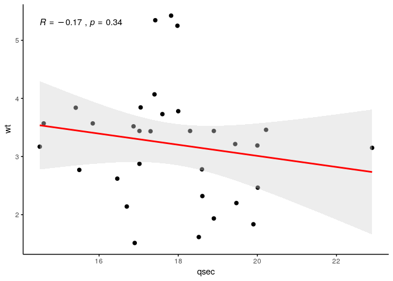
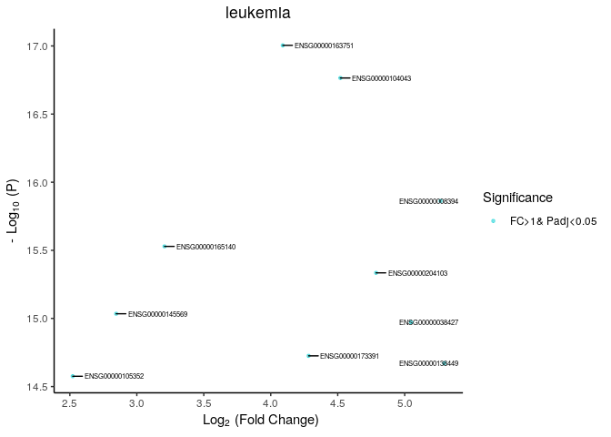

BioOutputs
================

-----

## Install Package

First install devtools to allow installation from gitub and any other
required packages.

``` r
install.packages("devtools")
```

``` r
library(devtools)
library(knitr)
```

Now install the BioOutputs package.

``` r
install_github("KatrionaGoldmann/BioOutputs")
library("BioOutputs")
```

-----

## bio\_corr

Create a correlation plot. Taken from kassambara/ggpubr just changed the
default arguments.

So we can use the classic example with the *mtcars* data
frames:

``` r
kable(head(mtcars))
```

|                   |  mpg | cyl | disp |  hp | drat |    wt |  qsec | vs | am | gear | carb |
| ----------------- | ---: | --: | ---: | --: | ---: | ----: | ----: | -: | -: | ---: | ---: |
| Mazda RX4         | 21.0 |   6 |  160 | 110 | 3.90 | 2.620 | 16.46 |  0 |  1 |    4 |    4 |
| Mazda RX4 Wag     | 21.0 |   6 |  160 | 110 | 3.90 | 2.875 | 17.02 |  0 |  1 |    4 |    4 |
| Datsun 710        | 22.8 |   4 |  108 |  93 | 3.85 | 2.320 | 18.61 |  1 |  1 |    4 |    1 |
| Hornet 4 Drive    | 21.4 |   6 |  258 | 110 | 3.08 | 3.215 | 19.44 |  1 |  0 |    3 |    1 |
| Hornet Sportabout | 18.7 |   8 |  360 | 175 | 3.15 | 3.440 | 17.02 |  0 |  0 |    3 |    2 |
| Valiant           | 18.1 |   6 |  225 | 105 | 2.76 | 3.460 | 20.22 |  1 |  0 |    3 |    1 |

``` r
bio_corr(mtcars, "qsec", "wt")
```

    ## Loading required package: bitops

<!-- -->

## bio\_frequency

The *bio\_frequency()* function generates a frequency table from factor
or character vector columns in a data frame. This has the following
arguments:

| Argument     |                                                                                                                                 |
| ------------ | ------------------------------------------------------------------------------------------------------------------------------- |
| data         | A data frame containing columns to be counted                                                                                   |
| columns      | Column names or indices to be counted in data                                                                                   |
| freq.percent | Whether the table should include frequency counts, percentages or both (options = c(“freq”, “percent”, “both”)). Default=“both” |
| include.na   | Include NA values (options are TRUE/FALSE, default=TRUE)                                                                        |
| remove.vars  | Character vector of variables not to be included in the counts (e.g. remove.vars = c("") remove blanks from the count)          |

Then if we want to see the breakdown of, say, the gear column in mtcars
we can apply:

``` r
kable(bio_frequency(mtcars, "gear"))
```

|      | 3        | 4        | 5       | Total  |
| ---- | :------- | :------- | :------ | :----- |
| gear | 15 (47%) | 12 (38%) | 5 (16%) | n = 32 |

And if wanted we can remove one variable from the table. This is useful
if we have unknowns or the likes.

``` r
kable(bio_frequency(mtcars, "gear", remove.vars=c("5")))
```

|      | 3        | 4        | Total  |
| ---- | :------- | :------- | :----- |
| gear | 15 (56%) | 12 (44%) | n = 27 |

-----

## bio\_volcano

This function generates a volcano plot from a top table using ggplot.
The function contains many parameters, use `?bio_volcano` to interogate.

Lets look at the leukemia data set

``` r
BiocManager::install("leukemiasEset", version = "3.8")
```

``` r
library(leukemiasEset)
library(limma)
```

``` r
data(leukemiasEset)
ourData <- leukemiasEset[, leukemiasEset$LeukemiaType %in% c("ALL", "NoL")]
ourData$LeukemiaType <- factor(ourData$LeukemiaType)

design <- model.matrix(~ ourData$LeukemiaType)
fit <- lmFit(ourData, design)
fit <- eBayes(fit)
toptable <- topTable(fit)
toptable$pvalue = toptable$P.Value
```

``` r
bio_volcano(toptable, fc.col="logFC", label.row.indices=1:10,
                                             main="leukemia", add.lines=FALSE)
```

<!-- -->
