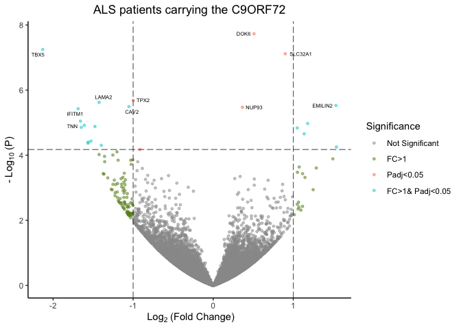

-   [BioOutputs](#biooutputs)
    -   [Gallery](#gallery)
    -   [Required packages](#required-packages)
    -   [Install Package](#install-package)
    -   [bio\_corr](#bio_corr)
    -   [bio\_frequency](#bio_frequency)
    -   [bio\_volcano](#bio_volcano)
    -   [bio\_bires](#bio_bires)
    -   [bio\_mods](#bio_mods)
    -   [bio\_treatmentGroups](#bio_treatmentgroups)
    -   [bio\_geneid](#bio_geneid)

------------------------------------------------------------------------

BioOutputs
==========

This package contains common R scripts I use in my day to day data
analysis of biological data. The scripts are primarily for plotting and
visualisation, with some data organisation thrown in as well.

------------------------------------------------------------------------

Gallery
-------

<table border="1">
  <tr>
    <td align="center" style="vertical-align:top" height="200"><a href="#bires">Bi-Results</a></td>
    <td align="center" style="vertical-align:top" height="200"><a href="#corrp">Correlation Plot</a></td>
    <td style="vertical-align:top" align="center" height="200"><a href="#freq">Frequency Table</a></td>
  </tr>
    <tr>
    <td align="center" style="vertical-align:top" height="200"><a href="#mods">Module Plot</a></td>
    <td align="center" style="vertical-align:top" height="200"><a href="#tgcomp">Treatment Group Comparisons</a></td>
    <td align="center" style="vertical-align:top" height="200"><a href="#volc">Volcano Plot</a></td>
  </tr>
    <tr>
        <td align="center" style="vertical-align:top" height="200"><a href="#geneids">Switching Gene Ids</a></td>
        <td align="center" style="vertical-align:top" height="200"></td>
    <td align="center" style="vertical-align:top" height="200"></td>
  </tr>
</table>

------------------------------------------------------------------------

Required packages
-----------------

[`dplyr`](https://dplyr.tidyverse.org)
[`ggplot2`](https://ggplot2.tidyverse.org)
[`ggrepel`](https://cran.r-project.org/web/packages/ggrepel/vignettes/ggrepel.html)
[`ComplexHeatmap`](http://bioconductor.org/packages/release/bioc/html/ComplexHeatmap.html)
[`RColorBrewer`](https://www.rdocumentation.org/packages/RColorBrewer/versions/1.1-2/topics/RColorBrewer)
[`Rmisc`](https://www.rdocumentation.org/packages/Rmisc/versions/1.5)
[`ggpubr`](https://cran.r-project.org/web/packages/ggpubr/index.html)
[`grid`](https://www.rdocumentation.org/packages/grid/versions/3.5.2)
[`pBrackets`](https://cran.r-project.org/web/packages/pBrackets/index.html)
[`biomaRt`](https://bioconductor.org/packages/release/bioc/html/biomaRt.html)

------------------------------------------------------------------------

Install Package
---------------

First install devtools to allow installation from gitub and any other
required packages.

    install.packages("devtools")
    library("devtools")

    ## Loading required package: ggplot2

    ## 
    ## Attaching package: 'cowplot'

    ## The following object is masked from 'package:ggplot2':
    ## 
    ##     ggsave

    library(devtools)
    library(knitr)

Now install the BioOutputs package.

    install_github("KatrionaGoldmann/BioOutputs")
    library("BioOutputs")

------------------------------------------------------------------------

<a id="corrp"></a>

bio\_corr
---------

Create a correlation plot. Taken from kassambara/ggpubr just changed the
default arguments.

So we can use the classic example with the *mtcars* data frames:

    kable(head(mtcars))

<table>
<thead>
<tr class="header">
<th></th>
<th style="text-align: right;">mpg</th>
<th style="text-align: right;">cyl</th>
<th style="text-align: right;">disp</th>
<th style="text-align: right;">hp</th>
<th style="text-align: right;">drat</th>
<th style="text-align: right;">wt</th>
<th style="text-align: right;">qsec</th>
<th style="text-align: right;">vs</th>
<th style="text-align: right;">am</th>
<th style="text-align: right;">gear</th>
<th style="text-align: right;">carb</th>
</tr>
</thead>
<tbody>
<tr class="odd">
<td>Mazda RX4</td>
<td style="text-align: right;">21.0</td>
<td style="text-align: right;">6</td>
<td style="text-align: right;">160</td>
<td style="text-align: right;">110</td>
<td style="text-align: right;">3.90</td>
<td style="text-align: right;">2.620</td>
<td style="text-align: right;">16.46</td>
<td style="text-align: right;">0</td>
<td style="text-align: right;">1</td>
<td style="text-align: right;">4</td>
<td style="text-align: right;">4</td>
</tr>
<tr class="even">
<td>Mazda RX4 Wag</td>
<td style="text-align: right;">21.0</td>
<td style="text-align: right;">6</td>
<td style="text-align: right;">160</td>
<td style="text-align: right;">110</td>
<td style="text-align: right;">3.90</td>
<td style="text-align: right;">2.875</td>
<td style="text-align: right;">17.02</td>
<td style="text-align: right;">0</td>
<td style="text-align: right;">1</td>
<td style="text-align: right;">4</td>
<td style="text-align: right;">4</td>
</tr>
<tr class="odd">
<td>Datsun 710</td>
<td style="text-align: right;">22.8</td>
<td style="text-align: right;">4</td>
<td style="text-align: right;">108</td>
<td style="text-align: right;">93</td>
<td style="text-align: right;">3.85</td>
<td style="text-align: right;">2.320</td>
<td style="text-align: right;">18.61</td>
<td style="text-align: right;">1</td>
<td style="text-align: right;">1</td>
<td style="text-align: right;">4</td>
<td style="text-align: right;">1</td>
</tr>
<tr class="even">
<td>Hornet 4 Drive</td>
<td style="text-align: right;">21.4</td>
<td style="text-align: right;">6</td>
<td style="text-align: right;">258</td>
<td style="text-align: right;">110</td>
<td style="text-align: right;">3.08</td>
<td style="text-align: right;">3.215</td>
<td style="text-align: right;">19.44</td>
<td style="text-align: right;">1</td>
<td style="text-align: right;">0</td>
<td style="text-align: right;">3</td>
<td style="text-align: right;">1</td>
</tr>
<tr class="odd">
<td>Hornet Sportabout</td>
<td style="text-align: right;">18.7</td>
<td style="text-align: right;">8</td>
<td style="text-align: right;">360</td>
<td style="text-align: right;">175</td>
<td style="text-align: right;">3.15</td>
<td style="text-align: right;">3.440</td>
<td style="text-align: right;">17.02</td>
<td style="text-align: right;">0</td>
<td style="text-align: right;">0</td>
<td style="text-align: right;">3</td>
<td style="text-align: right;">2</td>
</tr>
<tr class="even">
<td>Valiant</td>
<td style="text-align: right;">18.1</td>
<td style="text-align: right;">6</td>
<td style="text-align: right;">225</td>
<td style="text-align: right;">105</td>
<td style="text-align: right;">2.76</td>
<td style="text-align: right;">3.460</td>
<td style="text-align: right;">20.22</td>
<td style="text-align: right;">1</td>
<td style="text-align: right;">0</td>
<td style="text-align: right;">3</td>
<td style="text-align: right;">1</td>
</tr>
</tbody>
</table>

    bio_corr(mtcars, "qsec", "wt")

    ## Loading required package: bitops


------------------------------------------------------------------------

<a id="freq"></a>

bio\_frequency
--------------

The *bio\_frequency()* function generates a frequency table from factor
or character vector columns in a data frame. This has the following
arguments:

<table>
<colgroup>
<col style="width: 26%" />
<col style="width: 73%" />
</colgroup>
<thead>
<tr class="header">
<th>Argument</th>
<th></th>
</tr>
</thead>
<tbody>
<tr class="odd">
<td>data</td>
<td>A data frame containing columns to be counted</td>
</tr>
<tr class="even">
<td>columns</td>
<td>Column names or indices to be counted in data</td>
</tr>
<tr class="odd">
<td>freq.percent</td>
<td>Whether the table should include frequency counts, percentages or both (options = c(“freq”, “percent”, “both”)). Default=“both”</td>
</tr>
<tr class="even">
<td>include.na</td>
<td>Include NA values (options are TRUE/FALSE, default=TRUE)</td>
</tr>
<tr class="odd">
<td>remove.vars</td>
<td>Character vector of variables not to be included in the counts (e.g. remove.vars = c(&quot;&quot;) remove blanks from the count)</td>
</tr>
</tbody>
</table>

Then if we want to see the breakdown of, say, the gear column in mtcars
we can apply:

    kable(bio_frequency(mtcars, "gear"))

<table>
<thead>
<tr class="header">
<th></th>
<th style="text-align: left;">3</th>
<th style="text-align: left;">4</th>
<th style="text-align: left;">5</th>
<th style="text-align: left;">Total</th>
</tr>
</thead>
<tbody>
<tr class="odd">
<td>gear</td>
<td style="text-align: left;">15 (47%)</td>
<td style="text-align: left;">12 (38%)</td>
<td style="text-align: left;">5 (16%)</td>
<td style="text-align: left;">n = 32</td>
</tr>
</tbody>
</table>

And if wanted we can remove one variable from the table. This is useful
if we have unknowns or the likes.

    kable(bio_frequency(mtcars, "gear", remove.vars=c("5")))

<table>
<thead>
<tr class="header">
<th></th>
<th style="text-align: left;">3</th>
<th style="text-align: left;">4</th>
<th style="text-align: left;">Total</th>
</tr>
</thead>
<tbody>
<tr class="odd">
<td>gear</td>
<td style="text-align: left;">15 (56%)</td>
<td style="text-align: left;">12 (44%)</td>
<td style="text-align: left;">n = 27</td>
</tr>
</tbody>
</table>

------------------------------------------------------------------------

<a id="volc"></a>

bio\_volcano
------------

This function generates a volcano plot from a top table using ggplot.
The function contains many parameters, use `?bio_volcano` to interogate.

Lets look at the ALS patients carrying the C9ORF72 data set

<!-- ```{r, message=FALSE, warning=FALSE, eval=FALSE} -->
<!-- BiocManager::install("leukemiasEset", version = "3.8") -->
<!-- ``` -->
<!-- ```{r, message=FALSE, warning=FALSE} -->
<!-- library(leukemiasEset) -->
<!-- library(limma) -->
<!-- ``` -->
<!-- ```{r, message=FALSE, warning=FALSE} -->
<!-- data(leukemiasEset) -->
<!-- ourData <- leukemiasEset[, leukemiasEset$LeukemiaType %in% c("ALL", "NoL")] -->
<!-- ourData$LeukemiaType <- factor(ourData$LeukemiaType) -->
<!-- design <- model.matrix(~ ourData$LeukemiaType) -->
<!-- fit <- lmFit(ourData, design) -->
<!-- fit <- eBayes(fit) -->
<!-- toptable <- topTable(fit) -->
<!-- toptable$pvalue = toptable$P.Value -->
<!-- ``` -->
    toptable <- read.table("https://gist.githubusercontent.com/stephenturner/806e31fce55a8b7175af/raw/1a507c4c3f9f1baaa3a69187223ff3d3050628d4/results.txt", sep="", header=T)
    rownames(toptable) = toptable$Gene

    bio_volcano(toptable, fc.col="log2FoldChange", label.row.indices=1:10, main="ALS patients carrying the C9ORF72", add.lines=TRUE)



Lets look at the leukemia data set

    BiocManager::install("leukemiasEset", version = "3.8")

    library(leukemiasEset)
    library(limma)

    data(leukemiasEset)
    ourData <- leukemiasEset[, leukemiasEset$LeukemiaType %in% c("ALL", "NoL")]
    ourData$LeukemiaType <- factor(ourData$LeukemiaType)

    design <- model.matrix(~ ourData$LeukemiaType)
    fit <- lmFit(ourData, design)
    fit <- eBayes(fit)
    toptable <- topTable(fit)
    toptable$pvalue = toptable$P.Value

    bio_volcano(toptable, fc.col="logFC", label.row.indices=1:10, main="leukemia", add.lines=FALSE)


------------------------------------------------------------------------

<a id="bires"></a>

bio\_bires
----------

This function colours data according to whether it is below or above a
defined plane. The plane is plotted as a line and data can be output as
either a line or markers/points.

    data(beavers)
    df.plane = beaver1
    df.data = beaver2
    df.plane$temp <- df.plane$temp + 0.5
    bio_bires(x="time", y="temp", df.data, x.plane="time", y.plane="temp", df.plane)


<a id="mods"></a>

bio\_mods
---------

This function splits expression data into customisable modules and
averages over catagories in a given variable. In this example we will
look at two Li modules and a custom one I made up.

    ## 

    exp = rld.syn
    meta <- rld.metadata.syn

    bio_mods(exp=exp, mod.list=mod_list, meta=meta, mean.var = "Pathotype", cluster.rows = FALSE)


<a id="tgcomp"></a>

bio\_treatmentGroups
--------------------

    library(survival)
    data(kidney)

    df <- kidney
    df <- df[df$time < 150, ]

    bio_treatmentGroups(df, group.col="status", y.col="frail", x.col="time")


<a id="geneids"></a>

bio\_geneid
-----------

    IDs = c("TNF", "A1BG")
    kable(bio_geneid(IDs, IDFrom='hgnc_symbol', IDTo = 'ensembl_transcript_id'))

<table>
<thead>
<tr class="header">
<th style="text-align: left;">hgnc_symbol</th>
<th style="text-align: left;">ensembl_transcript_id</th>
<th style="text-align: left;">chromosome_name</th>
<th style="text-align: right;">start_position</th>
<th style="text-align: right;">end_position</th>
</tr>
</thead>
<tbody>
<tr class="odd">
<td style="text-align: left;">A1BG</td>
<td style="text-align: left;">ENST00000596924</td>
<td style="text-align: left;">19</td>
<td style="text-align: right;">58345178</td>
<td style="text-align: right;">58353499</td>
</tr>
<tr class="even">
<td style="text-align: left;">A1BG</td>
<td style="text-align: left;">ENST00000263100</td>
<td style="text-align: left;">19</td>
<td style="text-align: right;">58345178</td>
<td style="text-align: right;">58353499</td>
</tr>
<tr class="odd">
<td style="text-align: left;">A1BG</td>
<td style="text-align: left;">ENST00000595014</td>
<td style="text-align: left;">19</td>
<td style="text-align: right;">58345178</td>
<td style="text-align: right;">58353499</td>
</tr>
<tr class="even">
<td style="text-align: left;">A1BG</td>
<td style="text-align: left;">ENST00000598345</td>
<td style="text-align: left;">19</td>
<td style="text-align: right;">58345178</td>
<td style="text-align: right;">58353499</td>
</tr>
<tr class="odd">
<td style="text-align: left;">A1BG</td>
<td style="text-align: left;">ENST00000600966</td>
<td style="text-align: left;">19</td>
<td style="text-align: right;">58345178</td>
<td style="text-align: right;">58353499</td>
</tr>
<tr class="even">
<td style="text-align: left;">TNF</td>
<td style="text-align: left;">ENST00000443707</td>
<td style="text-align: left;">CHR_HSCHR6_MHC_SSTO_CTG1</td>
<td style="text-align: right;">31566312</td>
<td style="text-align: right;">31569081</td>
</tr>
<tr class="odd">
<td style="text-align: left;">TNF</td>
<td style="text-align: left;">ENST00000445232</td>
<td style="text-align: left;">CHR_HSCHR6_MHC_APD_CTG1</td>
<td style="text-align: right;">31643520</td>
<td style="text-align: right;">31645322</td>
</tr>
<tr class="even">
<td style="text-align: left;">TNF</td>
<td style="text-align: left;">ENST00000383496</td>
<td style="text-align: left;">CHR_HSCHR6_MHC_QBL_CTG1</td>
<td style="text-align: right;">31565793</td>
<td style="text-align: right;">31568564</td>
</tr>
<tr class="odd">
<td style="text-align: left;">TNF</td>
<td style="text-align: left;">ENST00000420425</td>
<td style="text-align: left;">CHR_HSCHR6_MHC_DBB_CTG1</td>
<td style="text-align: right;">31557707</td>
<td style="text-align: right;">31560476</td>
</tr>
<tr class="even">
<td style="text-align: left;">TNF</td>
<td style="text-align: left;">ENST00000412275</td>
<td style="text-align: left;">CHR_HSCHR6_MHC_MANN_CTG1</td>
<td style="text-align: right;">31615015</td>
<td style="text-align: right;">31617784</td>
</tr>
<tr class="odd">
<td style="text-align: left;">TNF</td>
<td style="text-align: left;">ENST00000448781</td>
<td style="text-align: left;">CHR_HSCHR6_MHC_MCF_CTG1</td>
<td style="text-align: right;">31651872</td>
<td style="text-align: right;">31654641</td>
</tr>
<tr class="even">
<td style="text-align: left;">TNF</td>
<td style="text-align: left;">ENST00000376122</td>
<td style="text-align: left;">CHR_HSCHR6_MHC_COX_CTG1</td>
<td style="text-align: right;">31562973</td>
<td style="text-align: right;">31565742</td>
</tr>
<tr class="odd">
<td style="text-align: left;">TNF</td>
<td style="text-align: left;">ENST00000449264</td>
<td style="text-align: left;">6</td>
<td style="text-align: right;">31575567</td>
<td style="text-align: right;">31578336</td>
</tr>
</tbody>
</table>
