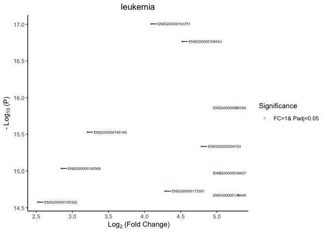
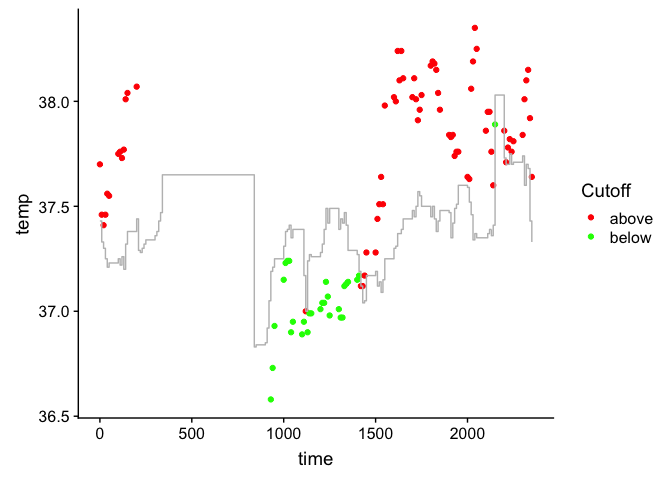
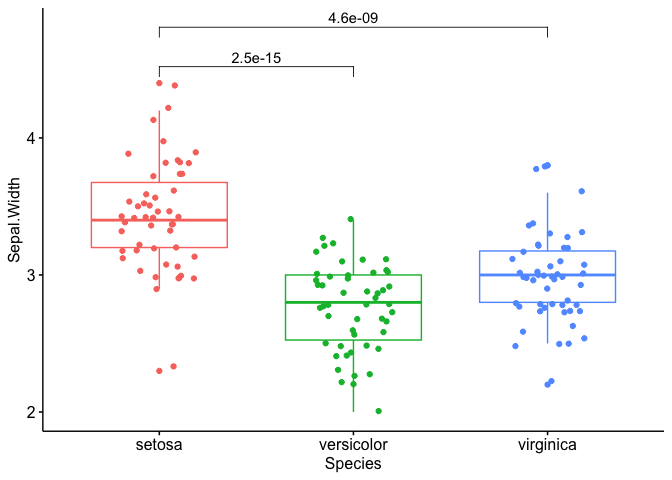

------------------------------------------------------------------------

BioOutputs
==========

This package contains common R scripts I use in my day to day data
analysis of biological data. The scripts are primarily for plotting and
visualisation, with some data organisation thrown in as well.

------------------------------------------------------------------------

Gallery
-------

<table border="1">
  <tr>
    <td align="center" style="vertical-align:top" height="200"><a href="#bires">Bi-Results</a></td>
    <td align="center" style="vertical-align:top" height="200"><a href="#corrp">Correlation Plot</a></td>
    <td style="vertical-align:top" align="center" height="200"><a href="#freq">Frequency Table</a></td>
  </tr>
    <tr>
    <td align="center" style="vertical-align:top" height="200"><a href="#mods">Module Plot</a></td>
    <td align="center" style="vertical-align:top" height="200"><a href="#tgcomp">Treatment Group Comparisons</a></td>
    <td align="center" style="vertical-align:top" height="200"><a href="#volc">Volcano Plot</a></td>
  </tr>
    <tr>
        <td align="center" style="vertical-align:top" height="200"><a href="#geneids">Switching Gene Ids</a></td>
        <td align="center" style="vertical-align:top" height="200"><a href="#fcp">Fold Change Heatmap</a></td>
    <td align="center" style="vertical-align:top" height="200"><a href="#boxp">Significance Boxplots</a></td>
  </tr>
    <tr>
        <td align="center" style="vertical-align:top" height="200"><a href="#sankey">Sankey Plots</a></td>
        <td align="center" style="vertical-align:top" height="200"><a href="#cap">Capitalize Phrases</a></td>
    <td align="center" style="vertical-align:top" height="200"></td>
  </tr>
</table>

------------------------------------------------------------------------

Required packages
-----------------

[`dplyr`](https://dplyr.tidyverse.org)
[`ggplot2`](https://ggplot2.tidyverse.org)
[`ggrepel`](https://cran.r-project.org/web/packages/ggrepel/vignettes/ggrepel.html)
[`ComplexHeatmap`](http://bioconductor.org/packages/release/bioc/html/ComplexHeatmap.html)
[`RColorBrewer`](https://www.rdocumentation.org/packages/RColorBrewer/versions/1.1-2/topics/RColorBrewer)
[`Rmisc`](https://www.rdocumentation.org/packages/Rmisc/versions/1.5)
[`ggpubr`](https://cran.r-project.org/web/packages/ggpubr/index.html)
[`gtools`](https://cran.r-project.org/web/packages/gtools/index.html)
[`grid`](https://www.rdocumentation.org/packages/grid/versions/3.5.2)
[`pBrackets`](https://cran.r-project.org/web/packages/pBrackets/index.html)
[`biomaRt`](https://bioconductor.org/packages/release/bioc/html/biomaRt.html)

------------------------------------------------------------------------

Install Package
---------------

First install devtools to allow installation from gitub and any other
required packages.

    install.packages("devtools")
    library("devtools")

    library(devtools)
    library(knitr)

Now install the BioOutputs package.

    install_github("KatrionaGoldmann/BioOutputs")
    library("BioOutputs")

------------------------------------------------------------------------

<a id="corrp"></a>

bio\_corr
---------

Create a correlation plot. Taken from kassambara/ggpubr just changed the
default arguments.

So we can use the classic example with the *mtcars* data frames:

    kable(head(mtcars))

<table>
<thead>
<tr class="header">
<th></th>
<th align="right">mpg</th>
<th align="right">cyl</th>
<th align="right">disp</th>
<th align="right">hp</th>
<th align="right">drat</th>
<th align="right">wt</th>
<th align="right">qsec</th>
<th align="right">vs</th>
<th align="right">am</th>
<th align="right">gear</th>
<th align="right">carb</th>
</tr>
</thead>
<tbody>
<tr class="odd">
<td>Mazda RX4</td>
<td align="right">21.0</td>
<td align="right">6</td>
<td align="right">160</td>
<td align="right">110</td>
<td align="right">3.90</td>
<td align="right">2.620</td>
<td align="right">16.46</td>
<td align="right">0</td>
<td align="right">1</td>
<td align="right">4</td>
<td align="right">4</td>
</tr>
<tr class="even">
<td>Mazda RX4 Wag</td>
<td align="right">21.0</td>
<td align="right">6</td>
<td align="right">160</td>
<td align="right">110</td>
<td align="right">3.90</td>
<td align="right">2.875</td>
<td align="right">17.02</td>
<td align="right">0</td>
<td align="right">1</td>
<td align="right">4</td>
<td align="right">4</td>
</tr>
<tr class="odd">
<td>Datsun 710</td>
<td align="right">22.8</td>
<td align="right">4</td>
<td align="right">108</td>
<td align="right">93</td>
<td align="right">3.85</td>
<td align="right">2.320</td>
<td align="right">18.61</td>
<td align="right">1</td>
<td align="right">1</td>
<td align="right">4</td>
<td align="right">1</td>
</tr>
<tr class="even">
<td>Hornet 4 Drive</td>
<td align="right">21.4</td>
<td align="right">6</td>
<td align="right">258</td>
<td align="right">110</td>
<td align="right">3.08</td>
<td align="right">3.215</td>
<td align="right">19.44</td>
<td align="right">1</td>
<td align="right">0</td>
<td align="right">3</td>
<td align="right">1</td>
</tr>
<tr class="odd">
<td>Hornet Sportabout</td>
<td align="right">18.7</td>
<td align="right">8</td>
<td align="right">360</td>
<td align="right">175</td>
<td align="right">3.15</td>
<td align="right">3.440</td>
<td align="right">17.02</td>
<td align="right">0</td>
<td align="right">0</td>
<td align="right">3</td>
<td align="right">2</td>
</tr>
<tr class="even">
<td>Valiant</td>
<td align="right">18.1</td>
<td align="right">6</td>
<td align="right">225</td>
<td align="right">105</td>
<td align="right">2.76</td>
<td align="right">3.460</td>
<td align="right">20.22</td>
<td align="right">1</td>
<td align="right">0</td>
<td align="right">3</td>
<td align="right">1</td>
</tr>
</tbody>
</table>

    bio_corr(mtcars, "qsec", "wt")


------------------------------------------------------------------------

<a id="freq"></a>

bio\_frequency
--------------

The *bio\_frequency()* function generates a frequency table from factor
or character vector columns in a data frame. This has the following
arguments:

<table style="width:100%;">
<colgroup>
<col width="27%" />
<col width="72%" />
</colgroup>
<thead>
<tr class="header">
<th>Argument</th>
<th></th>
</tr>
</thead>
<tbody>
<tr class="odd">
<td>data</td>
<td>A data frame containing columns to be counted</td>
</tr>
<tr class="even">
<td>columns</td>
<td>Column names or indices to be counted in data</td>
</tr>
<tr class="odd">
<td>freq.percent</td>
<td>Whether the table should include frequency counts, percentages or both (options = c(&quot;freq&quot;, &quot;percent&quot;, &quot;both&quot;)). Default=&quot;both&quot;</td>
</tr>
<tr class="even">
<td>include.na</td>
<td>Include NA values (options are TRUE/FALSE, default=TRUE)</td>
</tr>
<tr class="odd">
<td>remove.vars</td>
<td>Character vector of variables not to be included in the counts (e.g. remove.vars = c(&quot;&quot;) remove blanks from the count)</td>
</tr>
</tbody>
</table>

Then if we want to see the breakdown of, say, the gear column in mtcars
we can apply:

    kable(bio_frequency(mtcars, "gear"))

<table>
<thead>
<tr class="header">
<th></th>
<th align="left">3</th>
<th align="left">4</th>
<th align="left">5</th>
<th align="left">Total</th>
</tr>
</thead>
<tbody>
<tr class="odd">
<td>gear</td>
<td align="left">15 (47%)</td>
<td align="left">12 (38%)</td>
<td align="left">5 (16%)</td>
<td align="left">n = 32</td>
</tr>
</tbody>
</table>

And if wanted we can remove one variable from the table. This is useful
if we have unknowns or the likes.

    kable(bio_frequency(mtcars, "gear", remove.vars=c("5")))

<table>
<thead>
<tr class="header">
<th></th>
<th align="left">3</th>
<th align="left">4</th>
<th align="left">Total</th>
</tr>
</thead>
<tbody>
<tr class="odd">
<td>gear</td>
<td align="left">15 (56%)</td>
<td align="left">12 (44%)</td>
<td align="left">n = 27</td>
</tr>
</tbody>
</table>

------------------------------------------------------------------------

<a id="volc"></a>

bio\_volcano
------------

This function generates a volcano plot from a top table using ggplot.
The function contains many parameters, use `?bio_volcano` to interogate.

<table style="width:100%;">
<colgroup>
<col width="27%" />
<col width="72%" />
</colgroup>
<thead>
<tr class="header">
<th>Argument</th>
<th></th>
</tr>
</thead>
<tbody>
<tr class="odd">
<td>toptable</td>
<td>A data frame containing p value and fold change columns for parameters compared across multiple groups. The p value column should be named &quot;pvalue&quot;.</td>
</tr>
<tr class="even">
<td>fc.col</td>
<td>The column name which stores the fold change. Should be in the log2 format (default=&quot;log2FC&quot;)</td>
</tr>
<tr class="odd">
<td>padj.col</td>
<td>The column which contains adjusted p-values. If NULL adjusted pvalues will be calculated</td>
</tr>
<tr class="even">
<td>padj.method</td>
<td>correction method. Options include: c(&quot;holm&quot;, &quot;hochberg&quot;, &quot;hommel&quot;, &quot;bonferroni&quot;, &quot;BH&quot;, &quot;BY&quot;, &quot;fdr&quot;, &quot;none&quot;). Default=&quot;fdr</td>
</tr>
<tr class="odd">
<td>padj.cutoff</td>
<td>The cutoff for adjusted pvalues. This adds a horizontal line of significance (default=NULL)</td>
</tr>
<tr class="even">
<td>fc.cutoff</td>
<td>The log2(fold change) significance cut-off (default=1)</td>
</tr>
<tr class="odd">
<td>marker.colour</td>
<td>Character vector of four colours to map to the volcano plot. In the order non-significanct, fold-change significant, pvalue significant, significant in fold-change and pvalues (default=c(&quot;grey60&quot;, &quot;olivedrab&quot;, &quot;salmon&quot;, &quot;darkturquoise&quot;))</td>
</tr>
<tr class="even">
<td>label.p.cutoff</td>
<td>The cutoff for adjusted pvalues for labelling (default=NULL). Not recommended if many significant rows.</td>
</tr>
<tr class="odd">
<td>label.row.indices</td>
<td>Indices of rows to be labelled (default=NULL)</td>
</tr>
<tr class="even">
<td>label.colour</td>
<td>Colour of labels (default=&quot;black&quot;)</td>
</tr>
<tr class="odd">
<td>legend.labs</td>
<td>A character vector for theThe legend label names (default=c(&quot;Not Significant&quot;, &quot;FC&gt;fc.cutoff&quot;, &quot;Padj&lt;padj.cutoff&quot;, &quot;FC&gt;fc.cutoff&amp; Padj&lt;padj.cutoff&quot;))</td>
</tr>
<tr class="even">
<td>add.lines</td>
<td>Whether to add dashed lines at fc.cutoff and padj.cutoff (default=TRUE)</td>
</tr>
<tr class="odd">
<td>line.colour</td>
<td>The color of dashed significance lines (default=&quot;grey14&quot;)</td>
</tr>
<tr class="even">
<td>main</td>
<td>Plot title</td>
</tr>
<tr class="odd">
<td>xlims, ylims</td>
<td>The plot limits</td>
</tr>
</tbody>
</table>

Lets look at the ALS patients carrying the C9ORF72 data set

<!-- ```{r, message=FALSE, warning=FALSE, eval=FALSE} -->
<!-- BiocManager::install("leukemiasEset", version = "3.8") -->
<!-- ``` -->
<!-- ```{r, message=FALSE, warning=FALSE} -->
<!-- library(leukemiasEset) -->
<!-- library(limma) -->
<!-- ``` -->
<!-- ```{r, message=FALSE, warning=FALSE} -->
<!-- data(leukemiasEset) -->
<!-- ourData <- leukemiasEset[, leukemiasEset$LeukemiaType %in% c("ALL", "NoL")] -->
<!-- ourData$LeukemiaType <- factor(ourData$LeukemiaType) -->
<!-- design <- model.matrix(~ ourData$LeukemiaType) -->
<!-- fit <- lmFit(ourData, design) -->
<!-- fit <- eBayes(fit) -->
<!-- toptable <- topTable(fit) -->
<!-- toptable$pvalue = toptable$P.Value -->
<!-- ``` -->
    toptable <- read.table("https://gist.githubusercontent.com/stephenturner/806e31fce55a8b7175af/raw/1a507c4c3f9f1baaa3a69187223ff3d3050628d4/results.txt", sep="", header=T)
    rownames(toptable) = toptable$Gene

    bio_volcano(toptable, fc.col="log2FoldChange", label.row.indices=1:10, main="ALS patients carrying the C9ORF72", add.lines=TRUE)


Lets look at the leukemia data set

    BiocManager::install("leukemiasEset", version = "3.8")

    library(leukemiasEset)
    library(limma)

    data(leukemiasEset)
    ourData <- leukemiasEset[, leukemiasEset$LeukemiaType %in% c("ALL", "NoL")]
    ourData$LeukemiaType <- factor(ourData$LeukemiaType)

    design <- model.matrix(~ ourData$LeukemiaType)
    fit <- lmFit(ourData, design)
    fit <- eBayes(fit)
    toptable <- topTable(fit)
    toptable$pvalue = toptable$P.Value

    bio_volcano(toptable, fc.col="logFC", label.row.indices=1:10, main="leukemia", add.lines=FALSE)



------------------------------------------------------------------------

<a id="bires"></a>

bio\_bires
----------

This function colours data according to whether it is below or above a
defined plane. The plane is plotted as a line and data can be output as
either a line or markers/points.

<table style="width:100%;">
<colgroup>
<col width="27%" />
<col width="72%" />
</colgroup>
<thead>
<tr class="header">
<th>Argument</th>
<th></th>
</tr>
</thead>
<tbody>
<tr class="odd">
<td>x</td>
<td>x column name in data</td>
</tr>
<tr class="even">
<td>y</td>
<td>y column name in data</td>
</tr>
<tr class="odd">
<td>df.data</td>
<td>Data frame containing x and y columns</td>
</tr>
<tr class="even">
<td>x.plane</td>
<td>column name for the x axis in df.plane</td>
</tr>
<tr class="odd">
<td>y.plane</td>
<td>column name for the y axis in df.plane</td>
</tr>
<tr class="even">
<td>df.plane</td>
<td>Date frame modelling the plane</td>
</tr>
<tr class="odd">
<td>stepwise</td>
<td>logical whether to plot the cutoff plane as stepwise or smoothed</td>
</tr>
<tr class="even">
<td>colours</td>
<td>colour vector for higher, lower and plane values (default=c(&quot;green&quot;, &quot;red&quot;, &quot;grey) respectively)</td>
</tr>
<tr class="odd">
<td>inc.equal</td>
<td>logical whethere points on the line should be counted as above (dafault=TRUE)</td>
</tr>
<tr class="even">
<td>labels</td>
<td>label for the markers (default=c(&quot;above&quot;, &quot;below&quot;))</td>
</tr>
<tr class="odd">
<td>type</td>
<td>type of plot for data (options include point (dafault), line, stepwise)</td>
</tr>
</tbody>
</table>

Lets look at some beaver temperature data.

    data(beavers)
    df.plane = beaver1
    df.data = beaver2
    df.plane$temp <- df.plane$temp + 0.5
    bio_bires(x="time", y="temp", df.data, x.plane="time", y.plane="temp", df.plane)



<a id="mods"></a>

bio\_mods
---------

This function splits expression data into customisable modules and
averages over catagories in a given variable.

<table style="width:100%;">
<colgroup>
<col width="27%" />
<col width="72%" />
</colgroup>
<thead>
<tr class="header">
<th>Argument</th>
<th></th>
</tr>
</thead>
<tbody>
<tr class="odd">
<td>exp</td>
<td>data frame containing the expression data</td>
</tr>
<tr class="even">
<td>mod.list</td>
<td>A list of modules. Each element contains the list of genes for a modules. The gene names must match the rownames in the exp dataframe.</td>
</tr>
<tr class="odd">
<td>meta</td>
<td>Dataframe where each column contains an annotation/tract for samples in the heatmap. The order of samples in meta must match that of exp.</td>
</tr>
<tr class="even">
<td>cluster.rows</td>
<td>The method to use for clustering of rows</td>
</tr>
<tr class="odd">
<td>cols</td>
<td>Chacter vector, or named vector to fix the order, defining the colours of each mean.var group.</td>
</tr>
<tr class="even">
<td>main</td>
<td>Title of heatmap</td>
</tr>
<tr class="odd">
<td>show.names</td>
<td>Show row names. Logical.</td>
</tr>
<tr class="even">
<td>mean.subjects</td>
<td>Logical to determine whether to add a row for the mean value for all subjects in a group</td>
</tr>
<tr class="odd">
<td>split.var</td>
<td>Character defining the meta column to average (mean) over.</td>
</tr>
</tbody>
</table>

In this example we will look at two Li modules and a custom one I made
up.

    exp = rld.syn
    meta <- rld.metadata.syn

    bio_mods(exp=exp, mod.list=mod_list, meta=meta, mean.var = "Pathotype", cluster.rows = FALSE)

<a id="tgcomp"></a>

bio\_treatmentGroups
--------------------

This function plots a line graph comparing two treatment groups over
time.

<table>
<thead>
<tr class="header">
<th>Argument</th>
<th></th>
</tr>
</thead>
<tbody>
<tr class="odd">
<td>df</td>
<td>Data frame containing the data for both groups</td>
</tr>
<tr class="even">
<td>group.col</td>
<td>Column name which corresponding to the group of values in df</td>
</tr>
<tr class="odd">
<td>y.col</td>
<td>Column name corresponding to the y-axis values in df</td>
</tr>
<tr class="even">
<td>x.col</td>
<td>Column name corresponding to the x-axis values in df</td>
</tr>
<tr class="odd">
<td>id.col</td>
<td>Column name which corresponds to subject ID</td>
</tr>
<tr class="even">
<td>main</td>
<td>Title of pot</td>
</tr>
<tr class="odd">
<td>cols</td>
<td>Character vector for colours of lines</td>
</tr>
<tr class="even">
<td>p.col</td>
<td>Colour of p-value text</td>
</tr>
</tbody>
</table>

Lets look at kidney disease survival in this example from the survival
package.

    library(survival)
    data(kidney)

    df <- kidney
    df <- df[df$time < 150, ]

    bio_treatmentGroups(df, group.col="status", y.col="frail", x.col="time")


<a id="geneids"></a>

bio\_geneid
-----------

This function switches gene (or snp) ids using biomart

<table style="width:100%;">
<colgroup>
<col width="27%" />
<col width="72%" />
</colgroup>
<thead>
<tr class="header">
<th>Argument</th>
<th></th>
</tr>
</thead>
<tbody>
<tr class="odd">
<td>IDs</td>
<td>list of the Ids you want to convert</td>
</tr>
<tr class="even">
<td>IDFrom</td>
<td>What format these IDs are in (default Ensembl)</td>
</tr>
<tr class="odd">
<td>IDTo</td>
<td>What format you want the IDs converted to (default gene names)</td>
</tr>
<tr class="even">
<td>mart</td>
<td>The biomart to use. Typically, for humans you will want ensembl (default). Alternatives can be found at listEnsembl()</td>
</tr>
<tr class="odd">
<td>dataset</td>
<td>you want to use. To see the different datasets available within a biomaRt you can e.g. do: mart = useEnsembl('ENSEMBL_MART_ENSEMBL'), followed by listDatasets(mart).</td>
</tr>
<tr class="even">
<td>attributes</td>
<td>list of variables you want output</td>
</tr>
</tbody>
</table>

For example genes TNF and A1BG:

    IDs = c("TNF", "A1BG")
    #kable(bio_geneid(IDs, IDFrom='hgnc_symbol', IDTo = 'ensembl_transcript_id'))

<a id="fcp"></a>

bio\_fc\_heatmap
----------------

This function exports a complex heatmap looking at the expression of
different modules which can be customised.

<table style="width:100%;">
<colgroup>
<col width="27%" />
<col width="72%" />
</colgroup>
<thead>
<tr class="header">
<th>Argument</th>
<th></th>
</tr>
</thead>
<tbody>
<tr class="odd">
<td>exp</td>
<td>Expression Data</td>
</tr>
<tr class="even">
<td>var</td>
<td>Vector classing samples by variables</td>
</tr>
<tr class="odd">
<td>prefix</td>
<td>Prefix to Heatmap titles</td>
</tr>
<tr class="even">
<td>stars</td>
<td>whether pvales should be written as numeric or start (default=FALSE)</td>
</tr>
<tr class="odd">
<td>overlay</td>
<td>pvalues on fold change Heatmap or besidde (default = TRUE)</td>
</tr>
<tr class="even">
<td>logp</td>
<td>Whether or not to log the pvalues</td>
</tr>
<tr class="odd">
<td>...</td>
<td>Other parameters to pass to Complex Heatmap</td>
</tr>
</tbody>
</table>

    exp = rld.syn
    meta <- rld.metadata.syn

    bio_fc_heatmap(exp=exp, var=meta$Pathotype)

<a id="boxp"></a>

bio\_boxplots
-------------

Creates boxplots showing the significance between groups.

<table style="width:100%;">
<colgroup>
<col width="27%" />
<col width="72%" />
</colgroup>
<thead>
<tr class="header">
<th>Argument</th>
<th></th>
</tr>
</thead>
<tbody>
<tr class="odd">
<td>data</td>
<td>Data frame containing columns x and y</td>
</tr>
<tr class="even">
<td>x, y</td>
<td>x and y variable names for drawing.</td>
</tr>
<tr class="odd">
<td>p.cutoff</td>
<td>plot p-value if above p.cutoff threshold. To include all comparisons set as NULL.</td>
</tr>
<tr class="even">
<td>stars</td>
<td>Logical. Whether significance shown as numeric or stars</td>
</tr>
<tr class="odd">
<td>method</td>
<td>a character string indicating which method to be used for comparing means.c(&quot;t.test&quot;, &quot;wilcox.test&quot;)</td>
</tr>
<tr class="even">
<td>star.vals</td>
<td>a list of arguments to pass to the function symnum for symbolic number coding of p-values. For example, the dafault is symnum.args &lt;- list(cutpoints = c(0, 0.0001, 0.001, 0.01, 0.05, 1), symbols = c('****', '<em><strong>', '</strong>', '</em>', 'ns')). In other words, we use the following convention for symbols indicating statistical significance: ns: p &gt; 0.05; <em>: p &lt;= 0.05; <strong>: p &lt;= 0.01; </strong></em>: p &lt;= 0.001; ****: p &lt;= 0.0001</td>
</tr>
</tbody>
</table>

Lets look at the iris data:

    bio_boxplots(iris, x="Species", y= "Sepal.Width", p.cutoff = 0.0001)



    bio_boxplots(iris, x="Species", y= "Sepal.Width", NULL, stars=TRUE)


<a id="sankey"></a>

bio\_sankey
-----------

Creates a sankey plot *with heatmaps* showing how individuals progress
over time.

<table style="width:100%;">
<colgroup>
<col width="27%" />
<col width="72%" />
</colgroup>
<thead>
<tr class="header">
<th>Argument</th>
<th></th>
</tr>
</thead>
<tbody>
<tr class="odd">
<td>samp.orders</td>
<td>A list of named vectors for sample order at each timepoint. Vector names must correspond to matchable ids.</td>
</tr>
</tbody>
</table>

    library(lme4)
    library(ComplexHeatmap)
    data(sleepstudy)
    data = sleepstudy
    data = data[data$Days %in% c(0, 1, 2), ]
    data = data[data$Days !=1 | data$Subject != "308", ]
    time.col="Days"
    exp.cols = "Reaction"
    sub.col = "Subject"

    row.order=list()
    for(i in unique(data[, time.col])){
      hm = Heatmap(data[data[, time.col] == i, exp.cols])
      row.order[[paste('timepoint', as.character(i))]] = setNames(unlist(row_order(hm)), data[data[, time.col] == i, sub.col])
    }

    bio_sankey(samp.order=row.order)


<a id="cap"></a>

bio\_capitalize
---------------

Converts strings to appropriate format for titles according to Chicago
style.

<table style="width:100%;">
<colgroup>
<col width="27%" />
<col width="72%" />
</colgroup>
<thead>
<tr class="header">
<th>Argument</th>
<th></th>
</tr>
</thead>
<tbody>
<tr class="odd">
<td>titles</td>
<td>A character vector of phrases to be converted to titles</td>
</tr>
<tr class="even">
<td>exeption.words</td>
<td>A character vector of words with case to be forced (for example abbreviations and roman numerals)</td>
</tr>
<tr class="odd">
<td>replace.chars</td>
<td>A named list of characters to replace in title. This works in order of appearance. E.g. c(&quot;\.&quot;=&quot; &quot;) replaces fullstops with spaces.</td>
</tr>
</tbody>
</table>

    shakespeare_plays =c("all's well that ends well", "as you like it","comedy of errors","love's labour's lost", "measure for measure", "merchant of venice","merry wives of windsor","midsummer night's dream","much ado about nothing","taming of the shrew", "tempest", "twelfth night","two gentlemen of verona", "winter's tale", "henry iv, part i","henry iv, part ii", "henry v", "henry vi, part i","henry vi, part ii", "henry vi, part iii", "henry viii","king john", "pericles","richard ii", "richard iii", "antony and cleopatra","coriolanus","cymbeline", "hamlet","julius caesar", "king lear", "macbeth (the scottish play)", "othello", "romeo and juliet","timon of athens", "titus andronicus", "troilus and cressida")
    exception.words= c("I", "II", "III", "IV", "V", "VI") # Pass in exceptions

    bio_capitalize(head(shakespeare_plays), exception.words)
